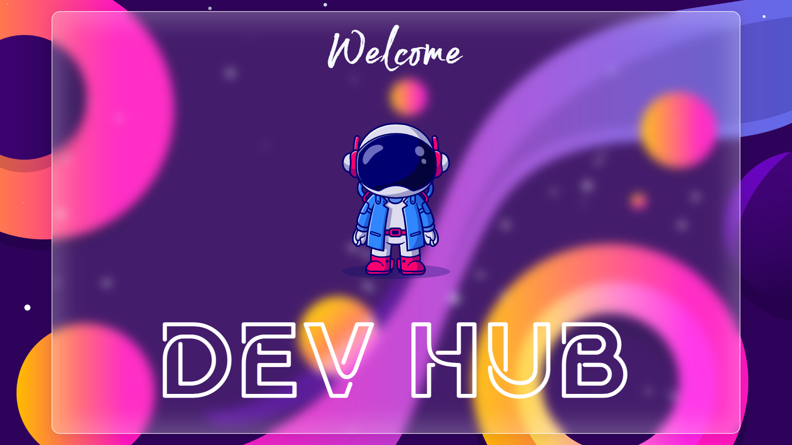

<!-- PROJECT SHIELDS -->
<!--
<div align="center">

[![Contributors][contributors-shield]][contributors-url]
[![Forks][forks-shield]][forks-url]
[![Stargazers][stars-shield]][stars-url]
[![Issues][issues-shield]][issues-url]
[![MIT License][license-shield]][license-url]
[![Skype][skype-shield]][skype-url]

</div>
<br />
-->

<!-- PROJECT LOGO -->
<h1 align = "center">Dev Hub: A Awesome Hub for all Developers</h1>
<div align="center">
    
</div>
<div align="center">
    
    
    
</div>

<!-- ABOUT THE PROJECT -->

## About The Project

Dev Hub is a coolest hub for all developers to get any kind of libraries & packages. And it's very easy and fast way to get them all in one place. We will include more libraries for each section & update soon. Also we are working on some cool code snippets that are used daily on live projects.

Libraries for CSS, JS, ICON, IMAGES, ANDROID, ML, API etc.

Note: `Next Js` version coming soon with more features, under development.

<!-- BUILT WITH -->

## Built With

All Tech Stacks that are using in this project:

-   HTML5
-   CSS3
-   Javascript | Jquery
-   SVG

Other tools you need know:

-   Figma
-   Illustrator

Here it seems that the main moto is to make the frontend awesome.

<!-- FOLDER STRUCTURE -->

## Folder Structure

```
├── client/
    ├── assets/             Other Resources Files
    ├── css/
        ├── components/     Css Component Files (header, footer, settings, loader)
        ├── libraries/      Css External Library Files
        ├── pages/          Css Main Site Page's Files
        ├── scss/           Sass Files
    ├── data/               Page Data Mapping Files [*.data.js]
    ├── fonts/              External Fonts
    ├── img/                All Images Files
    ├── js/
        ├── components/     Js Component Files (secure, responsive)
        ├── libraries/      Js External Library Files
    ├── src/                All Site Pages (css, js, img, icon)
    ├── index.html          Main Home Page
    ├── (Other Pages)       Extra Pages (404, new)
```

<!-- BEFORE YOU START -->

### Before You Start

-   Try to maintain the file format & folder structure.
-   Try to maintain proper file names.
-   Don't use capital or spaces for files names instead use `_` or `-`.

<!-- GETTING STARTED -->

## Getting Started

Please follow these simple steps to start working:

1. If you want to work on issue then comment, then if you get assigned.
2. Fork this Repo and clone your forked copy of the project.
3. Navigate to your project directory and open it in your code editor.
4. Always take a pull from the upstream repository to your main branch to keep it at par with the main project (updated repository).
5. Create a new branch and name it as according to the issue.
6. Start making your changes & after making changes.
7. Open a Pull Request with a name of the issue and describe about your changes with reasons.

### Add Your Name

Once your PR got merged, do not forget to add your name in `CONTRIBUTING` file. Further instructions are mentioned there.

<!-- ROADMAP -->

## Roadmap

See the [open issues](https://github.com/imniladri/DevHub/issues) for a full list of proposed features (and known issues).

-   [ ] Documentation at some places.
-   [ ] Addition of Some Cool Styles.
-   [ ] Addition of More Useful Libraries.
-   [ ] Give Chance to user to add their Library.
-   [ ] More Features for More Interactivity in Site.
-   [ ] Developing in `Next Js` with more features.

<!-- CONTACT -->

## Contact

### [Niladri Mondal](https://imniladri.in/)

[](https://join.skype.com/invite/x4ZrtKrM5uyv)
[](mailto:imniladrimondal@gmail.com)
[](https://github.com/imniladri/DevHub)

<!-- MARKDOWN LINKS & IMAGES -->

[contributors-shield]: https://img.shields.io/github/contributors/imniladri/DevHub.svg?style=for-the-badge&color
[contributors-url]: https://github.com/imniladri/DevHub/graphs/contributors
[forks-shield]: https://img.shields.io/github/forks/imniladri/DevHub.svg?style=for-the-badge&color=FFE400
[forks-url]: https://github.com/imniladri/DevHub/network/members
[stars-shield]: https://img.shields.io/github/stars/imniladri/DevHub.svg?style=for-the-badge&color=FFE400
[stars-url]: https://github.com/imniladri/DevHub/stargazers
[issues-shield]: https://img.shields.io/github/issues/imniladri/DevHub.svg?style=for-the-badge&color
[issues-url]: https://github.com/imniladri/DevHub/issues
[license-shield]: https://img.shields.io/github/license/imniladri/DevHub.svg?style=for-the-badge&color=3DB2FF
[license-url]: https://github.com/imniladri/DevHub/blob/master/LICENSE.txt
[skype-shield]: https://img.shields.io/badge/-Skype-white.svg?style=for-the-badge&logo=skype&logoColor=fff&color=00AFF0
[skype-url]: https://join.skype.com/invite/x4ZrtKrM5uyv
